# Nexus: The Autonomous Cloud Desktop Agent

Nexus is a state-of-the-art, voice-enabled autonomous agent designed to navigate, control, and execute complex workflows within a secure, persistent cloud-based desktop environment. Powered by the latest **Gemini** models through **Google Vertex AI**, Nexus bridges the gap between conversational AI and real-world task execution.

## 🚀 Project Highlights
- **Leverages Gemini 3.1 Pro, 3.0 Flash Preview Models and gemini flash native 2.5** for reasoning, vision, and voice.
- **Built with the Google GenAI SDK** for seamless integration with Vertex AI endpoints.
- **Powered by Google Cloud Services**, including Cloud Run (Serverless Compute), Artifact Registry, and Secret Manager.
- **Secure Sandbox Execution** using E2B Desktop Sandboxes for safe, isolated code and browser operations.

---

## 🏗️ Architecture Diagram

```mermaid
graph TB
    subgraph CLIENT["🖥️ Frontend — Next.js"]
        UI["App Shell<br/>(React Components)"]
        CHAT["Unified Chat Panel"]
        DESKTOP["Desktop Panel<br/>(VNC Stream Viewer)"]
        MIC["Mic Button<br/>(PCM Audio Capture)"]
        AUTH_CTX["Auth Context<br/>(Firebase Client SDK)"]
        WS_HOOK["useWebSocket Hook"]
        API_CLIENT["API Client<br/>(REST Calls)"]
    end

    subgraph FIREBASE_SERVICES["🔥 Firebase / Google Cloud"]
        FB_AUTH["Firebase Authentication<br/>(ID Token Verification)"]
        FIRESTORE[("Cloud Firestore<br/>• users<br/>• sessions<br/>• messages<br/>• usage_records<br/>• user_settings")]
    end

    subgraph BACKEND["⚙️ Backend — FastAPI (Python)"]
        SERVER["server.py<br/>FastAPI App"]

        subgraph REST_API["REST Endpoints"]
            HEALTH["/health"]
            SESSIONS_EP["/sessions (CRUD)"]
            HISTORY["/api/v1/history"]
            SETTINGS_EP["/api/v1/user/settings"]
            QUOTA["/api/v1/user/quota"]
            DASHBOARD["/api/v1/dashboard/*"]
            GDRIVE_OAUTH["/api/v1/auth/google-drive/*"]
        end

        WS_EP["/ws/{session_id}<br/>WebSocket Endpoint"]
        WS_HANDLER["ws_handler.py<br/>Message Router"]
        AUTH_MW["auth.py<br/>Firebase Token Verification"]
        SESSION_MGR["session.py<br/>SessionManager"]
        HISTORY_REPO["history_repository.py<br/>FirestoreHistoryRepository"]
        RUNTIME_CFG["runtime_config.py<br/>SessionRuntimeConfig"]
        CRYPTO_MOD["crypto.py<br/>(BYOK Encryption)"]
    end
    
    subgraph ORCHESTRATION["🧠 Orchestration Layer"]
        ORCH["orchestrator.py<br/>NexusOrchestrator<br/>(voice → think → act → see)"]
        BG_TASKS["background_tasks.py<br/>BackgroundTaskManager"]
    end

    subgraph GOOGLE_ADK["🤖 Google ADK — Multi-Agent System"]
        subgraph AGENT_HIERARCHY["Agent Hierarchy"]
            ORCH_AGENT["Orchestrator Agent<br/>(Task Router)"]
            COMPUTER_AGENT["Computer Agent<br/>(GUI Control)"]
            BROWSER_AGENT["Browser Agent<br/>(Web Browsing)"]
            CODE_AGENT["Code Agent<br/>(Terminal/Code)"]
        end
        
        ADK_RUNNER["ADK Runner<br/>google.adk.runners.Runner"]
        ADK_SESSION["InMemorySessionService"]
        CRED_GEMINI["CredentialedGemini<br/>(Per-Session Credentials)"]
    end

    subgraph GEMINI_MODELS["💎 Gemini Models (Google AI)"]
        GEMINI_LIVE["Gemini Live 2.5 Flash<br/>(Native Audio)<br/>Bidirectional Voice"]
        GEMINI_VISION["Gemini 3 Flash Preview<br/>(Vision/Agent Reasoning)"]
        GEMINI_FALLBACK["Fallback Models<br/>• gemini-3.1-flash-lite<br/>• gemini-2.5-pro<br/>• gemini-3.1-pro<br/>• gemini-2.5-flash"]
    end

    subgraph VOICE_LAYER["🎤 Voice Layer"]
        VOICE_MGR["voice.py<br/>GeminiLiveManager<br/>(Bidirectional Audio Stream)"]
    end

    subgraph VISION_LAYER["👁️ Vision Layer"]
        VISION["vision.py<br/>VisionAnalyzer<br/>(Screenshot Analysis)"]
    end

    subgraph TOOLS["🔧 Agent Tools"]
        SCREEN_TOOL["screen.py<br/>take_screenshot"]
        COMPUTER_TOOL["computer.py<br/>mouse/keyboard/scroll/drag"]
        BASH_TOOL["bash.py<br/>run_command"]
        BROWSER_TOOL["browser.py<br/>open_browser"]
        BG_TOOL["bg_task.py<br/>request_background_task"]
    end

    subgraph SANDBOX["📦 E2B Desktop Sandbox"]
        SANDBOX_MGR["sandbox.py<br/>SandboxManager"]
        E2B["E2B Desktop API<br/>(Cloud Linux Desktop)"]
        VNC_STREAM["VNC Stream<br/>(Live Desktop View)"]
    end

    subgraph EXTERNAL["🌐 External Integrations"]
        KILO["Kilo AI Gateway<br/>(OpenAI-Compatible)"]
        GDRIVE["Google Drive API<br/>(OAuth 2.0 + rclone mount)"]
        GOOGLE_OAUTH["Google OAuth 2.0"]
    end

    %% Client → Backend connections
    AUTH_CTX -->|"Firebase ID Token"| FB_AUTH
    API_CLIENT -->|"REST + Bearer Token"| SERVER
    WS_HOOK -->|"WebSocket + JWT Ticket"| WS_EP
    MIC -->|"PCM Audio (16kHz)"| WS_HOOK

    %% Backend internal flow
    SERVER --> AUTH_MW
    AUTH_MW -->|"verify_id_token()"| FB_AUTH
    SERVER --> REST_API
    SERVER --> SESSIONS_EP
    SESSIONS_EP --> SESSION_MGR
    SESSION_MGR --> SANDBOX_MGR
    SESSION_MGR --> HISTORY_REPO
    HISTORY_REPO --> FIRESTORE
    WS_EP --> WS_HANDLER
    WS_HANDLER --> ORCH
    RUNTIME_CFG --> CRYPTO_MOD

    %% Orchestrator flow
    ORCH -->|"handle_user_audio()"| VOICE_MGR
    ORCH -->|"run_agent_turn()"| ADK_RUNNER
    ORCH -->|"analyze_screen()"| VISION
    ORCH --> BG_TASKS
    ORCH --> HISTORY_REPO

    %% ADK internals
    ADK_RUNNER --> ADK_SESSION
    ADK_RUNNER --> ORCH_AGENT
    ORCH_AGENT -->|"delegate"| COMPUTER_AGENT
    ORCH_AGENT -->|"delegate"| BROWSER_AGENT
    ORCH_AGENT -->|"delegate"| CODE_AGENT
    CRED_GEMINI -->|"google.genai.Client"| GEMINI_VISION
    ORCH_AGENT --> CRED_GEMINI
    COMPUTER_AGENT --> CRED_GEMINI
    BROWSER_AGENT --> CRED_GEMINI
    CODE_AGENT --> CRED_GEMINI

    %% Voice connections
    VOICE_MGR -->|"Live Bidirectional<br/>Audio + Transcription"| GEMINI_LIVE
    VOICE_MGR -->|"TTS: send_text()"| GEMINI_LIVE
    VOICE_MGR -->|"STT: receive_events()"| GEMINI_LIVE

    %% Vision connections
    VISION -->|"generate_content()<br/>+ screenshot JPEG"| GEMINI_VISION
    VISION -->|"model fallback chain"| GEMINI_FALLBACK

    %% Tools → Sandbox
    SCREEN_TOOL --> SANDBOX_MGR
    COMPUTER_TOOL --> SANDBOX_MGR
    BASH_TOOL --> SANDBOX_MGR
    BROWSER_TOOL --> SANDBOX_MGR
    SANDBOX_MGR --> E2B
    E2B --> VNC_STREAM

    %% VNC to frontend
    VNC_STREAM -.->|"iframe stream"| DESKTOP

    %% External integrations
    CRED_GEMINI -.->|"Kilo fallback"| KILO
    GDRIVE_OAUTH --> GOOGLE_OAUTH
    SESSION_MGR -->|"rclone mount"| GDRIVE

    %% Styling
    classDef firebase fill:#FF9800,stroke:#F57C00,color:#fff
    classDef gemini fill:#4285F4,stroke:#3367D6,color:#fff
    classDef adk fill:#0F9D58,stroke:#0B8043,color:#fff
    classDef e2b fill:#AB47BC,stroke:#8E24AA,color:#fff
    classDef frontend fill:#00BCD4,stroke:#0097A7,color:#fff
    classDef tool fill:#78909C,stroke:#546E7A,color:#fff

    class FB_AUTH,FIRESTORE firebase
    class GEMINI_LIVE,GEMINI_VISION,GEMINI_FALLBACK gemini
    class ORCH_AGENT,COMPUTER_AGENT,BROWSER_AGENT,CODE_AGENT,ADK_RUNNER,ADK_SESSION,CRED_GEMINI adk
    class E2B,VNC_STREAM,SANDBOX_MGR e2b
    class UI,CHAT,DESKTOP,MIC,AUTH_CTX,WS_HOOK,API_CLIENT frontend
    class SCREEN_TOOL,COMPUTER_TOOL,BASH_TOOL,BROWSER_TOOL,BG_TOOL tool
```


  
*A visual representation showing how the Next.js frontend connects to the FastAPI backend, which orchestrates between Google Vertex AI (Gemini), Firebase (Auth/Store), and the E2B Sandbox environment.*

If the image or Mermaid is not visible in your viewer, use the plain-text detailed architecture here:  
[View Detailed Architecture (No Mermaid)](./docs/ARCHITECTURE.md)

Core runtime flow (Agent + Gemini):

```text
User -> Frontend (Next.js) -> Backend (FastAPI /ws + REST)
Backend Orchestrator -> Gemini (reasoning + tool calls)
Backend Tools -> E2B Sandbox (browser/mouse/keyboard/bash/screenshot)
Screenshot/Audio -> Gemini Vision + Gemini Live
Gemini output -> Backend -> Frontend (text/audio/events)
```

---

## 📺 Demonstration Video
[**Watch the 4-Minute Demo Video Here**](https://www.youtube.com/watch?v=9g9S6vdoNbA)  
*This video showcases the agent's ability to browse the web, execute terminal commands, and persist data across sessions using Google Drive.*

---

## 🌟 Features & Functionality
- **Autonomous Desktop Control:** Navigate a full Linux desktop via mouse/keyboard simulation and screen perception (Vision).
- **Voice & Live Interaction:** Low-latency, multi-modal conversations powered by Gemini Live.
- **Session Persistence:** Save and resume sandbox states, allowing for multi-day, complex operations.
- **Google Drive Integration:** Authenticate with OAuth to mount and sync files directly between your local machine and the cloud agent.
- **Bring Your Own Key (BYOK):** End-to-end encrypted storage for personal API keys, giving users total control over their compute costs.

---

## 🛠️ Technologies Used
- **AI/LLM:** Google Gemini (Vertex AI), Google GenAI SDK.
- **Frontend:** Next.js (TypeScript), Tailwind CSS, Framer Motion.
- **Backend:** Python (FastAPI), Pydantic (Settings/Validation).
- **Execution:** E2B Desktop Sandboxes (V8/WASM).
- **Authentication & Database:** Firebase Auth, Firestore.
- **Cloud Infrastructure:** Google Cloud Run, Google Artifact Registry, Google Secret Manager.

---

## ⚙️ Spin-up Instructions (Reproducibility)

### 1. Prerequisites
- Google Cloud Project with Vertex AI and Cloud Run APIs enabled.
- Firebase Project for Authentication and Firestore.
- E2B API Key (available at [e2b.dev](https://e2b.dev)).

### 2. Backend Setup (Agent)
```bash
cd agent
python -m venv .venv
source .venv/bin/activate  # or .venv\Scripts\activate on Windows
pip install -e .
cp .env.example .env  # Fill in your GCP and Firebase credentials
uvicorn nexus.server:app --reload
```

### 3. Frontend Setup
```bash
cd frontend
npm install
cp .env.example .env.local  # Fill in your Firebase and Agent URL
npm run dev
```

---

## 🧪 Reproducible Testing

To verify the agent's functionality, judges can follow these test cases once the project is spun up:

### Test 1: Autonomous Browser Control (Vision & Tools)
1.  Open a new chat session.
2.  Command the agent: *"Open google.com and search for 'latest AI news'."*
3.  **Verification:** The agent should open the browser in the sandbox, navigate to the URL, and use visual perception to identify the search box and results.

### Test 2: Terminal Operations (Bash execution)
1.  Command the agent: *"Create a folder named 'nexus-test', and inside it, create a file called 'hello.py' that prints 'Hello from Gemini'."*
2.  Command the agent: *"Run that python file."*
3.  **Verification:** The agent should execute the commands in the sandbox terminal and return the output ("Hello from Gemini").

### Test 3: Voice Interaction (Multi-modal)
1.  Click the microphone icon to start a Live session.
2.  Speak to the agent: *"Tell me what you see on the screen right now."*
3.  **Verification:** The agent should capture a screenshot, analyze it using the Vision API, and reply via audio with a description of the current desktop state.

### Test 4: Persistence (State Management)
1.  Open a terminal in the sandbox and run `touch persistence_check.txt`.
2.  End the session.
3.  Start a new session immediately.
4.  Ask the agent: *"Is the file persistence_check.txt still there?"*
5.  **Verification:** The agent should confirm the file exists, demonstrating the persistent sandbox snapshot feature.

---

## ☁️ Google Cloud Deployment (Automation & Proof)

### Automated Deployment
This project includes a fully automated deployment script: **`deploy/gcp/deploy.sh`**.  
This script handles:
1.  **Artifact Registry** repository creation.
2.  **Google Cloud Build** for containerizing both the agent and frontend.
3.  **Cloud Run** deployment with proper environment variable and Secret Manager injection.

Before running the script, export the required Firebase web config values as environment variables such as `FIREBASE_API_KEY`, `FIREBASE_AUTH_DOMAIN`, `FIREBASE_PROJECT_ID`, `FIREBASE_STORAGE_BUCKET`, `FIREBASE_MESSAGING_SENDER_ID`, and `FIREBASE_APP_ID`. Do not hardcode those values in tracked files.

### Proof of Deployment
- **Deployment Script:** [View `deploy/gcp/deploy.sh`](./deploy/gcp/deploy.sh)
- **Vertex AI Implementation:** [View `agent/nexus/vision.py`](./agent/nexus/vision.py) for direct integration with Vertex AI endpoints.
- **Live Logs Proof:** [Link to screenshot/video of Cloud Run logs](https://link-to-your-proof.com)

---

## 💡 Findings & Learnings
Throughout the development of Nexus, several key insights were discovered:
- **Vision-Driven UX:** Fine-tuning the balance between screen resolution and Vision model latency is critical for a responsive "real-time" feel.
- **Hybrid Auth:** Implementing the BYOK (Bring Your Own Key) model required robust encryption (AES-GCM) to ensure user keys are never stored in plaintext on the server.
- **Persistent Sandboxes:** Managing the lifecycle of E2B sandboxes (Pause/Resume) significantly reduces the overhead of re-initializing complex development environments.
- **Vertex AI Scalability:** Utilizing Vertex AI's regional endpoints (e.g., `us-central1`) provided the necessary stability for streaming audio and vision tasks compared to global-only endpoints.

---

## 🏆 Bonus Points
- **Automated Deployment:** Confirmed via Terraform-style shell automation in `deploy/gcp/deploy.sh`.
- **Content Creation:** [Read the Hackathon Blog Post Here](https://link-to-your-blog.com)  
  *“How I built a persistent cloud desktop agent using Gemini Live and Google Cloud.”*
- **Community:** [Link to Google Developer Group Profile](https://developers.google.com/community/gdg/profile/your-profile)
